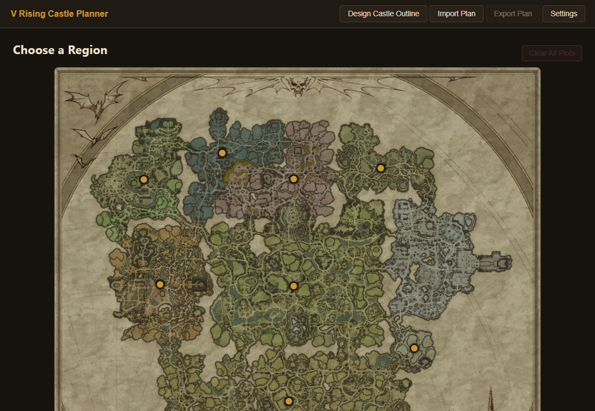
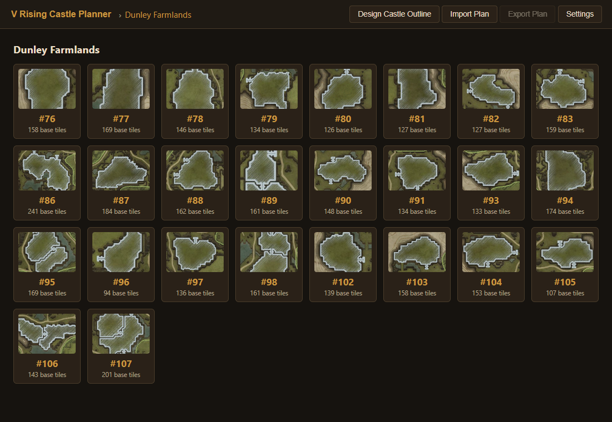
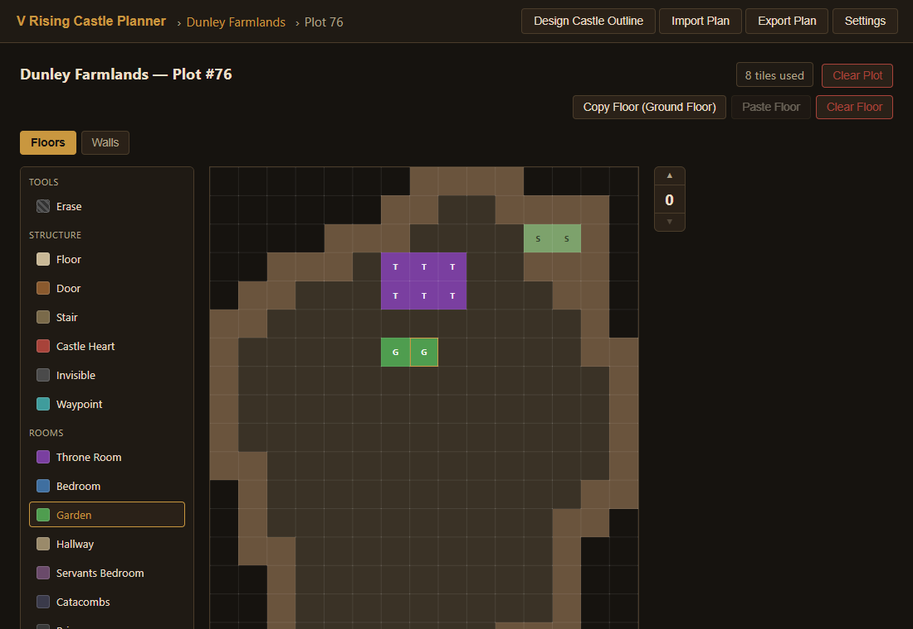
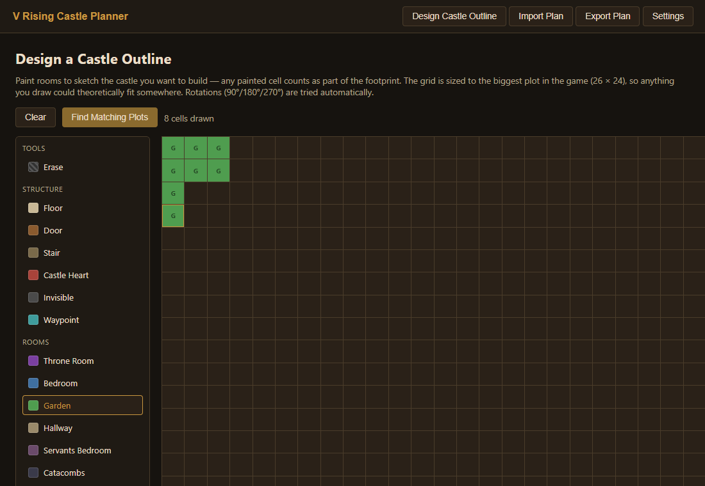
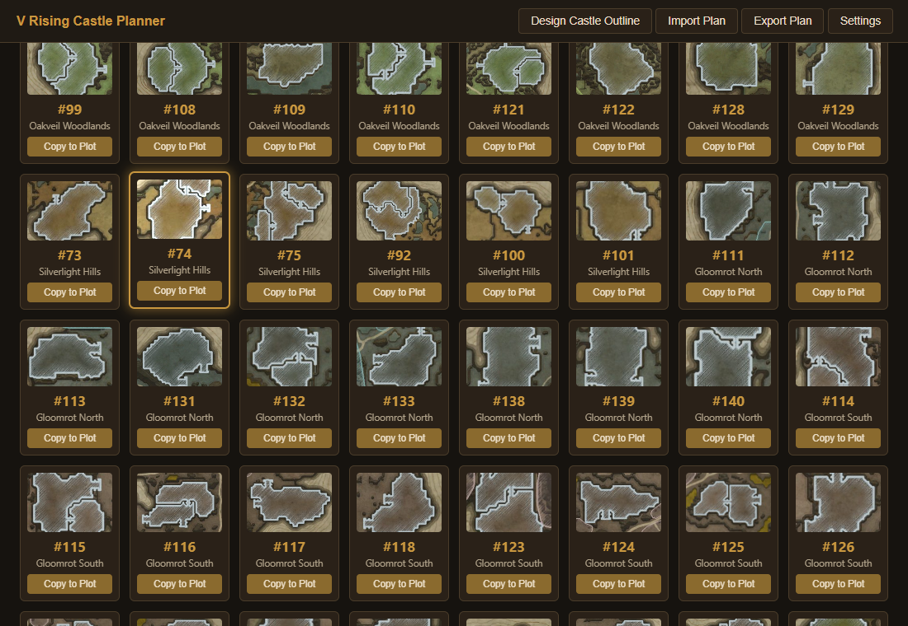

# V Rising Castle Planner

A browser-based planner for [V Rising](https://www.vrising.com/) castles. Pick a region, pick a real building plot, and sketch your castle floor-by-floor on a grid that matches that plot's actual buildable terrain — walls, doors, windows, and all.

No install, no account, no build step — plans autosave to your browser as you go.

## Getting started

Just open it: **https://vrising-castle-planner.vercel.app**

## Features

**Region map** — Click a pin on the map of Vardoran to browse every building plot in that region, with a thumbnail and base-tile count for each.

**Per-plot editor** — Every plot's terrain is modeled tile-by-tile (road, water, unbuildable slopes, platforms, bridges...). The editor computes the actual buildable interior for you and only lets you paint inside it. Add floors above ground level, paint room types from the palette (Throne Room, Bedroom, Workshop, Forge, and more), then switch to the Walls layer to place walls, doors, and windows on the tile edges.

- Floor spinner to move between stories, each with its own layout
- Copy/paste a floor to reuse a layout on the next level up
- Live tile-usage counter and a legend for every terrain type
- Per-plot autosave to your browser (`localStorage`) — close the tab, come back later, nothing is lost

**Castle outline designer** — Not sure which plot fits your dream build? Sketch the shape you want on a blank grid sized to the biggest plot in the game, and the planner searches every plot in every region for a buildable footprint that matches — rotations included.

**Import / Export** — Export your plans to a `.json` file to back them up or share them; import to restore or merge them back in.

## Contributing

Issues and PRs welcome. This is a fan-made tool and isn't affiliated with Stunlock Studios.
